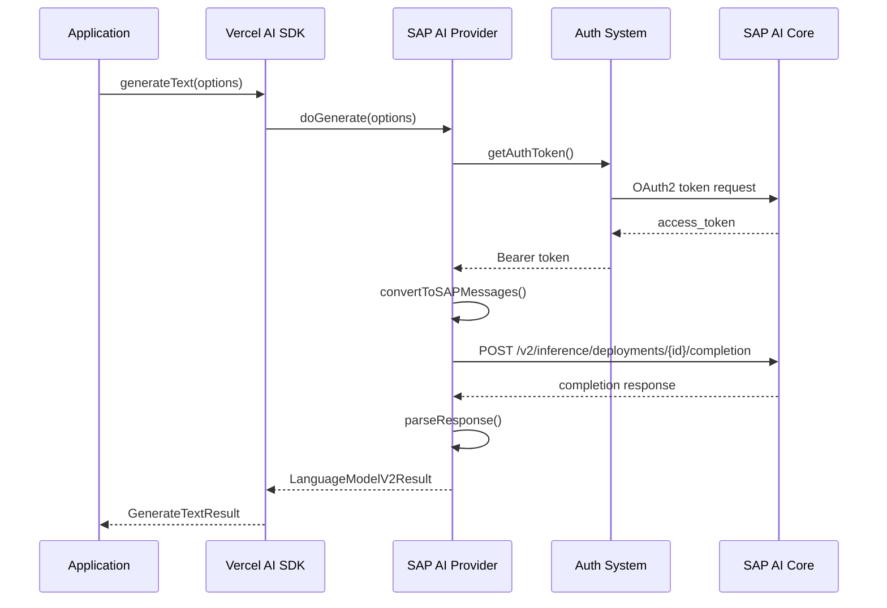
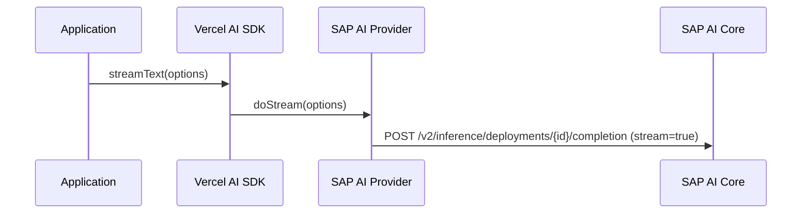
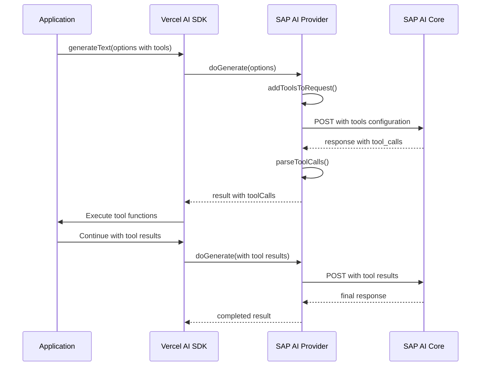

# SAP AI Core Provider Architecture

This document provides a detailed overview of the SAP AI Core Provider's architecture, internal components, and integration patterns.

## Table of Contents

- [Overview](#overview)
- [Component Architecture](#component-architecture)
- [Request/Response Flow](#requestresponse-flow)
- [Authentication System](#authentication-system)
- [Error Handling](#error-handling)
- [Type System](#type-system)
- [Integration Patterns](#integration-patterns)
- [Performance Considerations](#performance-considerations)

## Overview

The SAP AI Core Provider is designed as a bridge between the Vercel AI SDK and SAP AI Core services. It implements the Vercel AI SDK's `ProviderV2` interface while handling the complexities of SAP AI Core's API, authentication, and data formats.

```
┌─────────────────┐    ┌─────────────────┐    ┌─────────────────┐
│   Vercel AI     │    │   SAP AI Core   │    │   SAP AI Core   │
│     SDK         │◄──►│    Provider     │◄──►│   API Service   │
│                 │    │                 │    │                 │
└─────────────────┘    └─────────────────┘    └─────────────────┘
```

### Key Design Principles

1. **Compatibility**: Full compatibility with Vercel AI SDK interfaces
2. **Type Safety**: Comprehensive TypeScript types for all operations
3. **Error Resilience**: Robust error handling with automatic retries
4. **Performance**: Efficient request handling and response streaming
5. **Security**: Secure authentication and credential management

## Component Architecture

### Core Components

```
src/
├── index.ts                           # Public API exports
├── sap-ai-provider.ts                 # Main provider factory
├── sap-ai-chat-language-model.ts      # Language model implementation
├── sap-ai-chat-settings.ts            # Model configuration types
├── sap-ai-error.ts                    # Error handling system
├── convert-to-sap-messages.ts         # Message format conversion
└── types/
    ├── completion-request.ts          # Request format schemas
    └── completion-response.ts         # Response format schemas
```

### Component Responsibilities

#### `SAPAIProvider`
- **Purpose**: Factory for creating language model instances
- **Responsibilities**:
  - Authentication management
  - Configuration validation
  - Model instance creation
  - Base URL and deployment management

#### `SAPAIChatLanguageModel`
- **Purpose**: Implementation of Vercel AI SDK's `LanguageModelV2`
- **Responsibilities**:
  - Request/response transformation
  - Streaming support
  - Tool calling implementation
  - Multi-modal input handling

#### `Authentication System`
- **Purpose**: OAuth2 token management for SAP AI Core
- **Responsibilities**:
  - Service key parsing
  - Token acquisition and refresh
  - Credential validation

#### `Message Conversion`
- **Purpose**: Format translation between AI SDK and SAP AI Core
- **Responsibilities**:
  - Prompt format conversion
  - Multi-modal content handling
  - Tool call format transformation

## Request/Response Flow

### Standard Text Generation



### Streaming Text Generation



### Orchestration v2 Endpoint

- Default path used by this provider: `${baseURL}/inference/deployments/{deploymentId}/v2/completion`
- Top-level v2 endpoint: `POST /v2/completion` ([docs](https://api.sap.com/api/ORCHESTRATION_API_v2/resource/Orchestrated_Completion))
- Override with `completionPath: "/completion"` to target the top-level endpoint
  - For v1, use `completionPath: "/completion"` (deprecated; decommission on 31 Oct 2026)
  - Recommendation: prefer v2 and leave `completionPath` unset to use v2 by default

### Templating and Tools (v2)

- Request body is built under `config.modules.prompt_templating`
- `prompt.response_format` supports `text`, `json_object`, and `json_schema`
- Tools are passed under `prompt.tools` with function schemas
    SAP-->>Provider: Server-Sent Events
    loop For each SSE chunk
        Provider->>Provider: parseStreamChunk()
        Provider-->>SDK: LanguageModelV2StreamPart
        SDK-->>App: TextStreamPart
    end
```

### Tool Calling Flow



## Authentication System

### OAuth2 Flow

The provider implements the OAuth2 client credentials flow for SAP AI Core authentication:

```typescript
// Service key structure from SAP BTP
interface SAPAIServiceKey {
  serviceurls: { AI_API_URL: string };
  clientid: string;
  clientsecret: string;
  url: string; // OAuth2 server URL
  // ... other fields
}

// Token acquisition process
async function getOAuthToken(serviceKey: SAPAIServiceKey): Promise<string> {
  // 1. Create Basic Auth header from client credentials
  const credentials = Buffer.from(
    `${serviceKey.clientid}:${serviceKey.clientsecret}`
  ).toString('base64');

  // 2. Request token from OAuth2 server
  const response = await fetch(`${serviceKey.url}/oauth/token`, {
    method: 'POST',
    headers: {
      'Content-Type': 'application/x-www-form-urlencoded',
      'Authorization': `Basic ${credentials}`
    },
    body: 'grant_type=client_credentials'
  });

  // 3. Extract access token from response
  const { access_token } = await response.json();
  return access_token;
}
```

### Token Management

- **Automatic Refresh**: Tokens are refreshed automatically when expired
- **Error Handling**: Authentication errors are caught and retried
- **Security**: Credentials are never logged or exposed in error messages

## Error Handling

### Error Hierarchy

```typescript
Error
└── SAPAIError
    ├── AuthenticationError (401, 403)
    ├── RateLimitError (429)
    ├── ValidationError (400)
    ├── NotFoundError (404)
    └── ServerError (5xx)
```

### Error Response Handling

```typescript
export const sapAIFailedResponseHandler = createJsonErrorResponseHandler({
  errorSchema: sapAIErrorSchema,
  errorToMessage: (data) => {
    return data?.error?.message || 
           data?.message || 
           'An error occurred during the SAP AI Core request.';
  },
  isRetryable: (response) => {
    const status = response.status;
    return [429, 500, 502, 503, 504].includes(status);
  }
});
```

### Retry Logic

The provider implements exponential backoff for retryable errors:

1. **Immediate retry**: For network timeouts
2. **Exponential backoff**: For rate limits (429) and server errors (5xx)
3. **Circuit breaker**: After consecutive failures
4. **Jitter**: Random delay to prevent thundering herd

## Type System

### Model Configuration Types

```typescript
// Model identifiers with string union for type safety
type SAPAIModelId = 
  | 'gpt-4o'
  | 'claude-3.5-sonnet'
  | 'gemini-1.5-pro'
  // ... other models
  | (string & {}); // Allow custom models

// Comprehensive settings interface
interface SAPAISettings {
  modelVersion?: string;
  modelParams?: {
    maxTokens?: number;
    temperature?: number;
    topP?: number;
    frequencyPenalty?: number;
    presencePenalty?: number;
    n?: number;
  };
  safePrompt?: boolean;
  structuredOutputs?: boolean;
}
```

### Request/Response Schemas

All API interactions are validated using Zod schemas:

```typescript
// Request validation
export const sapAIRequestSchema = z.object({
  orchestration_config: z.object({
    module_configurations: z.object({
      llm_module_config: sapAILLMConfigSchema,
    }),
  }),
  input_params: z.object({
    messages: z.array(sapAIMessageSchema),
  }),
});

// Response validation
export const sapAIResponseSchema = z.object({
  request_id: z.string(),
  module_results: z.object({
    llm: sapAILLMResultSchema,
    templating: sapAITemplatingResultSchema,
  }),
  orchestration_results: z.object({
    choices: z.array(sapAIChoiceSchema),
    usage: sapAIUsageSchema,
  }).optional(),
});
```

## Integration Patterns

### Provider Pattern

The provider implements the factory pattern for model creation:

```typescript
interface SAPAIProvider extends ProviderV2 {
  // Function call syntax
  (modelId: SAPAIModelId, settings?: SAPAISettings): SAPAIChatLanguageModel;
  
  // Method call syntax
  chat(modelId: SAPAIModelId, settings?: SAPAISettings): SAPAIChatLanguageModel;
}
```

### Adapter Pattern

The message conversion system adapts between different formats:

```typescript
// Vercel AI SDK format
type LanguageModelV2Prompt = Array<{
  role: 'system' | 'user' | 'assistant' | 'tool';
  content: string | Array<ContentPart>;
}>;

// SAP AI Core format
type SAPMessage = {
  role: 'system' | 'user' | 'assistant' | 'tool';
  content: string | Array<{
    type: 'text' | 'image_url';
    text?: string;
    image_url?: { url: string };
  }>;
};

// Conversion function
export function convertToSAPMessages(
  prompt: LanguageModelV2Prompt
): SAPMessage[] {
  // Implementation handles format transformation
}
```

### Strategy Pattern

Different models may require different handling strategies:

```typescript
class SAPAIChatLanguageModel {
  private getModelStrategy(modelId: string) {
    if (modelId.startsWith('anthropic--')) {
      return new AnthropicStrategy();
    } else if (modelId.startsWith('gemini-')) {
      return new GeminiStrategy();
    } else {
      return new OpenAIStrategy();
    }
  }
}
```

## Performance Considerations

### Request Optimization

1. **Connection Pooling**: Reuse HTTP connections
2. **Request Batching**: Group multiple requests when possible
3. **Caching**: Cache responses and authentication tokens
4. **Compression**: Enable gzip/deflate for requests/responses

### Memory Management

1. **Stream Processing**: Use streams for large responses
2. **Garbage Collection**: Proper cleanup of resources
3. **Buffer Management**: Efficient handling of binary data

### Monitoring and Observability

```typescript
// Request tracking
const requestMetrics = {
  totalRequests: 0,
  successfulRequests: 0,
  failedRequests: 0,
  averageResponseTime: 0,
  tokensUsed: 0
};

// Performance monitoring
function trackRequest(startTime: number, success: boolean, tokens?: number) {
  const duration = Date.now() - startTime;
  requestMetrics.totalRequests++;
  
  if (success) {
    requestMetrics.successfulRequests++;
    if (tokens) requestMetrics.tokensUsed += tokens;
  } else {
    requestMetrics.failedRequests++;
  }
  
  requestMetrics.averageResponseTime = 
    (requestMetrics.averageResponseTime + duration) / 2;
}
```

### Scalability Patterns

1. **Horizontal Scaling**: Support for multiple instances
2. **Load Balancing**: Distribute requests across deployments
3. **Circuit Breaker**: Prevent cascade failures
4. **Rate Limiting**: Client-side rate limiting to prevent 429s

```typescript
class RateLimiter {
  private requests: number[] = [];
  
  async acquire(): Promise<void> {
    const now = Date.now();
    this.requests = this.requests.filter(time => now - time < 60000); // 1 minute window
    
    if (this.requests.length >= this.maxRequestsPerMinute) {
      const oldestRequest = Math.min(...this.requests);
      const waitTime = 60000 - (now - oldestRequest);
      await new Promise(resolve => setTimeout(resolve, waitTime));
    }
    
    this.requests.push(now);
  }
}
```

This architecture ensures the SAP AI Core Provider is robust, scalable, and maintainable while providing a seamless integration experience with the Vercel AI SDK.