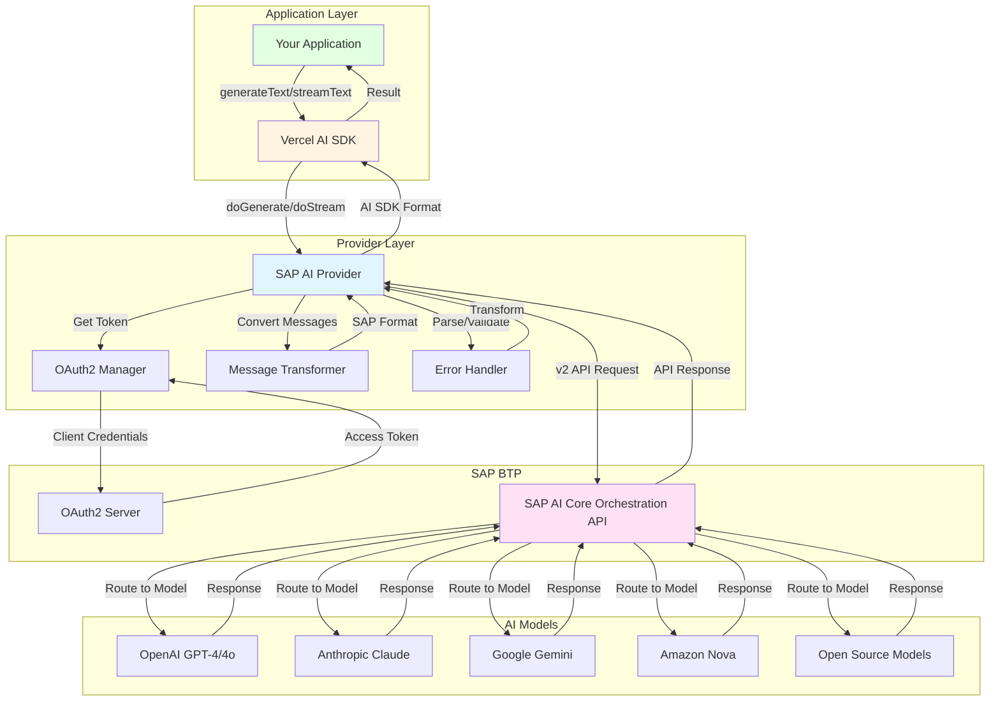
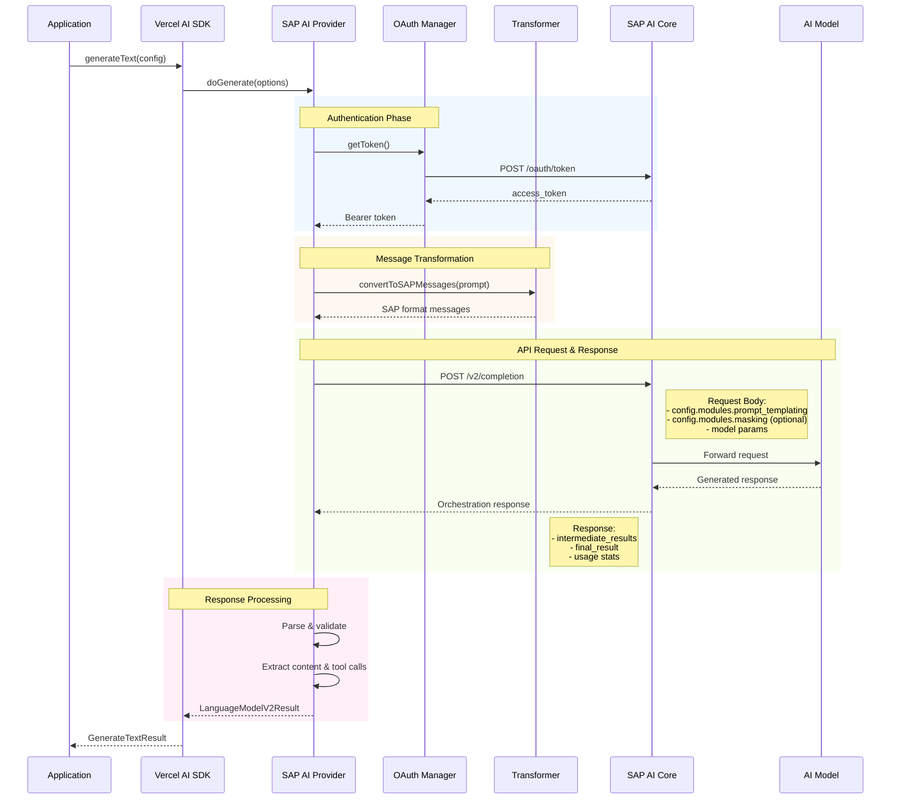
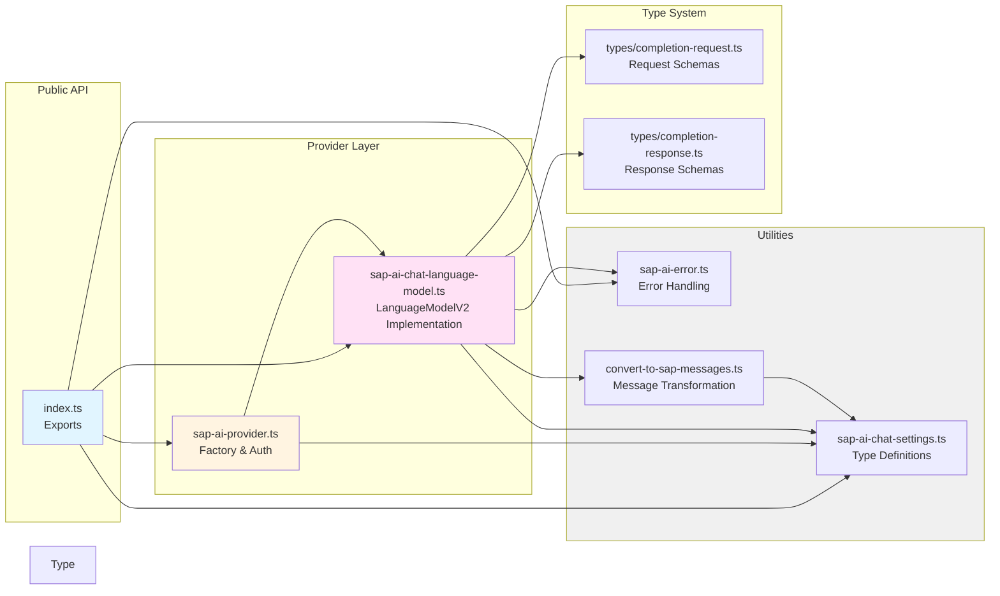
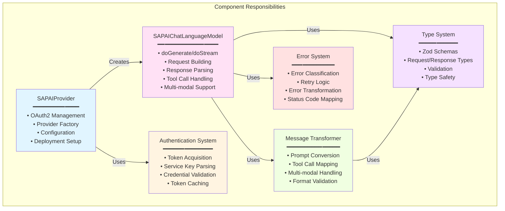
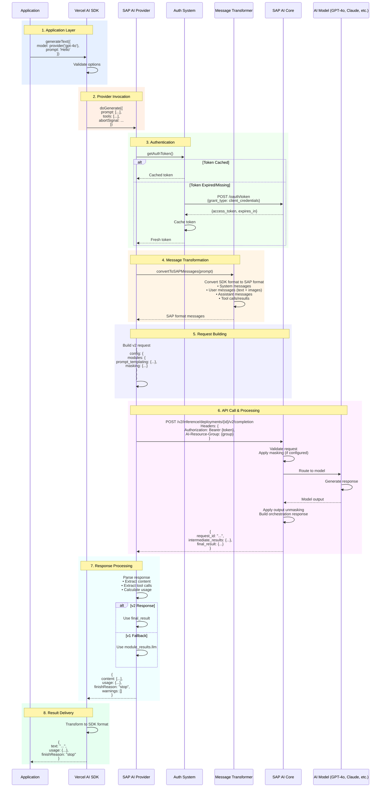
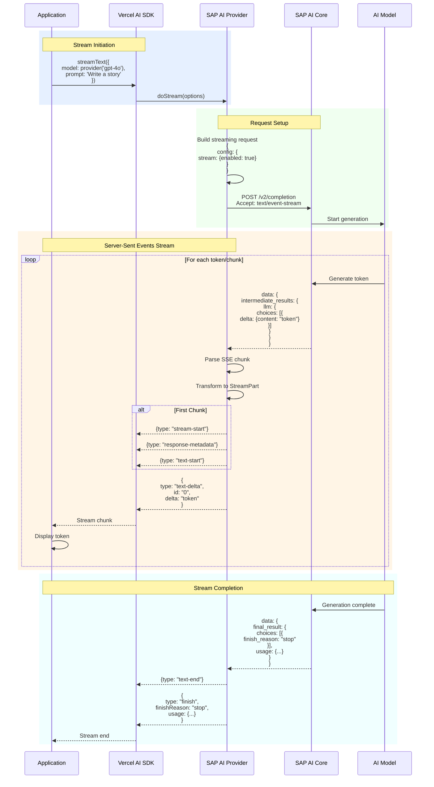
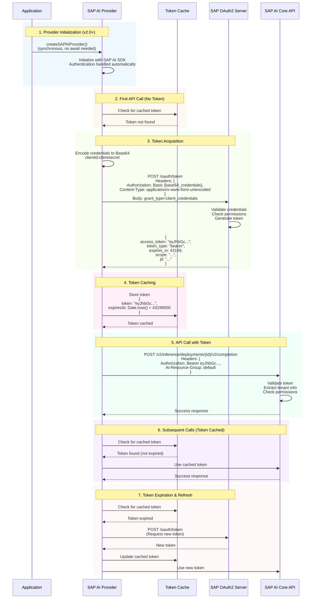

# SAP AI Core Provider Architecture

This document provides a detailed overview of the SAP AI Core Provider's architecture, internal components, and integration patterns.

**For general usage**, see [README.md](./README.md). **For API documentation**, see [API_REFERENCE.md](./API_REFERENCE.md).

## Table of Contents

- [Overview](#overview)
- [Component Architecture](#component-architecture)
- [Request/Response Flow](#requestresponse-flow)
- [Authentication System](#authentication-system)
- [Error Handling](#error-handling)
- [Type System](#type-system)
- [Integration Patterns](#integration-patterns)
- [Performance Considerations](#performance-considerations)

## Overview

The SAP AI Core Provider is designed as a bridge between the Vercel AI SDK and SAP AI Core services. It implements the Vercel AI SDK's `ProviderV2` interface while handling the complexities of SAP AI Core's API, authentication, and data formats.

### High-Level Architecture



### Component Interaction Flow



### Key Design Principles

1. **Compatibility**: Full compatibility with Vercel AI SDK interfaces
2. **Type Safety**: Comprehensive TypeScript types for all operations
3. **Error Resilience**: Robust error handling with automatic retries
4. **Performance**: Efficient request handling and response streaming
5. **Security**: Secure authentication and credential management

## Component Architecture

### Core Components Structure



### Component Interaction Map



### Detailed Component Flow

```
src/
├── index.ts                           # Public API exports
├── sap-ai-provider.ts                 # Main provider factory
├── sap-ai-chat-language-model.ts      # Language model implementation
├── sap-ai-chat-settings.ts            # Model configuration types
├── sap-ai-error.ts                    # Error handling system
├── convert-to-sap-messages.ts         # Message format conversion
└── types/
    ├── completion-request.ts          # Request format schemas
    └── completion-response.ts         # Response format schemas
```

### Component Responsibilities

#### `SAPAIProvider`

- **Purpose**: Factory for creating language model instances
- **Responsibilities**:
  - Authentication management
  - Configuration validation
  - Model instance creation
  - Base URL and deployment management

#### `SAPAIChatLanguageModel`

- **Purpose**: Implementation of Vercel AI SDK's `LanguageModelV2`
- **Responsibilities**:
  - Request/response transformation
  - Streaming support
  - Tool calling implementation
  - Multi-modal input handling

#### `Authentication System`

- **Purpose**: OAuth2 token management for SAP AI Core
- **Responsibilities**:
  - Service key parsing
  - Token acquisition and refresh
  - Credential validation

#### `Message Conversion`

- **Purpose**: Format translation between AI SDK and SAP AI Core
- **Responsibilities**:
  - Prompt format conversion
  - Multi-modal content handling
  - Tool call format transformation

## Request/Response Flow

### Standard Text Generation (Complete Flow)



### Streaming Text Generation (SSE Flow)



### Orchestration v2 Endpoint

SAP AI Core Orchestration v2 introduces a more structured API with improved capabilities:

**Default Path:**

```
${baseURL}/inference/deployments/{deploymentId}/v2/completion
```

**Top-level v2 endpoint:**

```
POST /v2/completion
```

([documentation](https://api.sap.com/api/ORCHESTRATION_API_v2/resource/Orchestrated_Completion))

**Configuration:**

```typescript
// Default configuration
const provider = createSAPAIProvider({
  resourceGroup: "default",
});

// With specific deployment
const provider = createSAPAIProvider({
  deploymentId: "d65d81e7c077e583",
  resourceGroup: "production",
});
```

### Request Structure (v2)

The v2 API uses a modular configuration structure:

```typescript
{
  config: {
    modules: {
      prompt_templating: {
        prompt: {
          template: [ /* messages */ ],
          defaults: { /* placeholder defaults */ },
          response_format: { /* text | json_object | json_schema */ },
          tools: [ /* function definitions */ ]
        },
        model: {
          name: "gpt-4o",
          version: "latest",
          params: {
            temperature: 0.7,
            max_tokens: 2000,
            // ... other params
          }
        }
      },
      masking: { /* optional DPI configuration */ }
    },
    stream: { /* optional streaming config */ }
  },
  placeholder_values: { /* optional values for template placeholders */ },
  messages_history: [ /* optional conversation history */ ]
}
```

### Response Structure (v2)

```typescript
{
  request_id: "uuid",
  intermediate_results: {
    templating: [ /* resolved messages */ ],
    llm: {
      id: "chatcmpl-xxx",
      object: "chat.completion",
      created: 1234567890,
      model: "gpt-4o-2024-08-06",
      choices: [{
        index: 0,
        message: {
          role: "assistant",
          content: "response text",
          tool_calls: [ /* if any */ ]
        },
        finish_reason: "stop"
      }],
      usage: {
        prompt_tokens: 100,
        completion_tokens: 50,
        total_tokens: 150
      }
    },
    output_unmasking: [ /* if masking enabled */ ]
  },
  final_result: { /* same structure as llm result */ }
}
```

### Templating and Tools (v2)

**Prompt Templating:**

- Messages are passed under `config.modules.prompt_templating.prompt.template`
- Supports system, user, assistant, tool, and developer roles
- Multi-modal content (text + images) supported

**Response Format:**

```typescript
// Text (default when no tools)
response_format: { type: "text" }

// JSON object
response_format: { type: "json_object" }

// JSON schema (structured output)
response_format: {
  type: "json_schema",
  json_schema: {
    name: "user_profile",
    description: "User profile schema",
    schema: {
      type: "object",
      properties: { /* JSON schema */ },
      required: [ /* required fields */ ]
    },
    strict: true
  }
}
```

**Tool Definitions:**

```typescript
tools: [
  {
    type: "function",
    function: {
      name: "calculator",
      description: "Perform arithmetic operations",
      parameters: {
        type: "object",
        properties: {
          operation: { type: "string", enum: ["add", "subtract"] },
          a: { type: "number" },
          b: { type: "number" },
        },
        required: ["operation", "a", "b"],
      },
    },
  },
];
```

### Data Masking Module (v2)

The masking module integrates with SAP Data Privacy Integration (DPI):

```typescript
modules: {
  prompt_templating: { /* ... */ },
  masking: {
    masking_providers: [{
      type: "sap_data_privacy_integration",
      method: "anonymization",  // or "pseudonymization"
      entities: [
        {
          type: "profile-email",
          replacement_strategy: { method: "fabricated_data" }
        },
        {
          type: "profile-person",
          replacement_strategy: { method: "constant", value: "REDACTED" }
        },
        {
          regex: "\\b[0-9]{4}-[0-9]{4}\\b",
          replacement_strategy: { method: "constant", value: "ID_REDACTED" }
        }
      ],
      allowlist: ["SAP", "BTP"],
      mask_grounding_input: { enabled: false }
    }]
  }
}
```

**Masking Flow:**

1. Input passes through masking module
2. Sensitive data is anonymized/pseudonymized
3. Masked data sent to LLM
4. Response passes through output_unmasking (if configured)
5. Original values restored in final output
   SAP-->>Provider: Server-Sent Events
   loop For each SSE chunk
   Provider->>Provider: parseStreamChunk()
   Provider-->>SDK: LanguageModelV2StreamPart
   SDK-->>App: TextStreamPart
   end

````

### Tool Calling Flow (Function Calling)

```mermaid
sequenceDiagram
    participant App as Application
    participant SDK as Vercel AI SDK
    participant Provider as SAP AI Provider
    participant SAP as SAP AI Core
    participant Model as AI Model
    participant Tool as Tool Function

    rect rgb(230, 240, 255)
        Note over App,SDK: 1. Initial Request with Tools
        App->>SDK: generateText({<br/>  model: provider('gpt-4o'),<br/>  prompt: 'What is 5+3 and weather in Tokyo?',<br/>  tools: {<br/>    calculate: calculatorTool,<br/>    getWeather: weatherTool<br/>  }<br/>})
    end

    rect rgb(255, 240, 230)
        Note over SDK,Provider: 2. Tool Registration
        SDK->>Provider: doGenerate({<br/>  prompt: [...],<br/>  tools: [<br/>    {type: "function", name: "calculate", ...},<br/>    {type: "function", name: "getWeather", ...}<br/>  ]<br/>})
        Provider->>Provider: Build request with tools<br/>{<br/>  config: {<br/>    modules: {<br/>      prompt_templating: {<br/>        prompt: {<br/>          tools: [{<br/>            type: "function",<br/>            function: {<br/>              name: "calculate",<br/>              parameters: {...}<br/>            }<br/>          }]<br/>        },<br/>        model: {<br/>          params: {<br/>            parallel_tool_calls: true<br/>          }<br/>        }<br/>      }<br/>    }<br/>  }<br/>}
    end

    rect rgb(240, 255, 240)
        Note over Provider,Model: 3. Model Decides to Use Tools
        Provider->>SAP: POST /v2/completion
        SAP->>Model: Forward request with tools
        Model->>Model: Analyze prompt<br/>Decide tool usage
        Model-->>SAP: Response with tool_calls
        SAP-->>Provider: {<br/>  final_result: {<br/>    choices: [{<br/>      message: {<br/>        role: "assistant",<br/>        content: null,<br/>        tool_calls: [<br/>          {id: "call_1", function: {<br/>            name: "calculate",<br/>            arguments: '{"a":5,"b":3}'<br/>          }},<br/>          {id: "call_2", function: {<br/>            name: "getWeather",<br/>            arguments: '{"city":"Tokyo"}'<br/>          }}<br/>        ]<br/>      },<br/>      finish_reason: "tool_calls"<br/>    }]<br/>  }<br/>}
    end

    rect rgb(255, 245, 230)
        Note over Provider,SDK: 4. Tool Call Extraction
        Provider->>Provider: Parse tool calls<br/>Extract: name, id, arguments
        Provider-->>SDK: {<br/>  content: [<br/>    {type: "tool-call", toolCallId: "call_1", ...},<br/>    {type: "tool-call", toolCallId: "call_2", ...}<br/>  ],<br/>  finishReason: "tool-calls"<br/>}
    end

    rect rgb(240, 240, 255)
        Note over SDK,Tool: 5. Tool Execution
        SDK->>App: Execute tools

        par Parallel Execution (if enabled)
            App->>Tool: calculate({a: 5, b: 3})
            Tool-->>App: 8
        and
            App->>Tool: getWeather({city: "Tokyo"})
            Tool-->>App: "sunny, 72°F"
        end

        App->>SDK: Tool results
    end

    rect rgb(255, 240, 255)
        Note over SDK,Model: 6. Continue with Tool Results
        SDK->>Provider: doGenerate({<br/>  prompt: [<br/>    ...previousMessages,<br/>    {role: "assistant", tool_calls: [...]},<br/>    {role: "tool", tool_call_id: "call_1", content: "8"},<br/>    {role: "tool", tool_call_id: "call_2", content: "sunny, 72°F"}<br/>  ]<br/>})
        Provider->>SAP: POST with tool results
        SAP->>Model: Continue generation
        Model->>Model: Process tool results<br/>Generate final response
        Model-->>SAP: Final answer
        SAP-->>Provider: {<br/>  final_result: {<br/>    choices: [{<br/>      message: {<br/>        role: "assistant",<br/>        content: "5+3=8. Tokyo weather: sunny, 72°F"<br/>      },<br/>      finish_reason: "stop"<br/>    }]<br/>  }<br/>}
    end

    rect rgb(230, 255, 240)
        Note over Provider,App: 7. Final Response
        Provider-->>SDK: {<br/>  content: [{type: "text", text: "..."}],<br/>  finishReason: "stop"<br/>}
        SDK-->>App: {<br/>  text: "5+3=8. Tokyo weather: sunny, 72°F",<br/>  toolCalls: [...],<br/>  toolResults: [...]<br/>}
    end
````

### Data Masking Flow (SAP DPI Integration)

```mermaid
sequenceDiagram
    participant App as Application
    participant Provider as SAP AI Provider
    participant SAP as SAP AI Core
    participant DPI as Data Privacy Integration
    participant Model as AI Model

    rect rgb(255, 240, 240)
        Note over App,Provider: 1. Request with Sensitive Data
        App->>Provider: generateText({<br/>  model: provider('gpt-4o', {<br/>    masking: {<br/>      masking_providers: [{<br/>        type: "sap_data_privacy_integration",<br/>        method: "anonymization",<br/>        entities: [<br/>          {type: "profile-email"},<br/>          {type: "profile-person"}<br/>        ]<br/>      }]<br/>    }<br/>  }),<br/>  prompt: "Email john.doe@example.com<br/>          about order 1234-5678"<br/>})
    end

    rect rgb(240, 255, 240)
        Note over Provider,DPI: 2. Masking Module Processing
        Provider->>SAP: POST /v2/completion<br/>{<br/>  config: {<br/>    modules: {<br/>      prompt_templating: {...},<br/>      masking: {<br/>        masking_providers: [{...}]<br/>      }<br/>    }<br/>  }<br/>}
        SAP->>DPI: Apply masking
        DPI->>DPI: Detect entities:<br/>• john.doe@example.com → EMAIL<br/>• order 1234-5678 → PATTERN
        DPI->>DPI: Replace:<br/>• EMAIL → fabricated@example.com<br/>• 1234-5678 → REDACTED_ID
        DPI-->>SAP: Masked prompt:<br/>"Email fabricated@example.com<br/>about order REDACTED_ID"
    end

    rect rgb(240, 240, 255)
        Note over SAP,Model: 3. LLM Processing
        SAP->>Model: Send masked prompt
        Model->>Model: Generate response<br/>(only sees masked data)
        Model-->>SAP: "I'll send email to<br/>fabricated@example.com<br/>about order REDACTED_ID"
    end

    rect rgb(255, 240, 255)
        Note over SAP,DPI: 4. Output Unmasking (optional)
        SAP->>DPI: Unmask output
        DPI->>DPI: Restore original values:<br/>• fabricated@example.com → john.doe@example.com<br/>• REDACTED_ID → 1234-5678
        DPI-->>SAP: Unmasked response
    end

    rect rgb(230, 255, 240)
        Note over SAP,App: 5. Return Response
        SAP-->>Provider: {<br/>  intermediate_results: {<br/>    templating: [masked messages],<br/>    llm: {...},<br/>    output_unmasking: [unmasked result]<br/>  },<br/>  final_result: {...}<br/>}
        Provider-->>App: Final text with<br/>original sensitive data<br/>preserved (if unmasking enabled)
    end
```

## Authentication System

### OAuth2 Authentication Flow



### OAuth2 Flow

Authentication is handled automatically by `@sap-ai-sdk/orchestration`:

- **Local**: `AICORE_SERVICE_KEY` environment variable
- **SAP BTP**: `VCAP_SERVICES` service binding

The SDK manages credentials, token acquisition, caching, and refresh internally.

## Error Handling

The provider implements robust internal error handling with automatic retry logic for transient failures.

**Error Response Processing:**

- Automatic categorization of HTTP error codes (401/403, 429, 400, 404, 5xx)
- JSON error response parsing and transformation to SDK-compatible format
- Retry logic with exponential backoff for rate limits (429) and server errors (5xx)

**For user-facing error handling guidance**, see [API_REFERENCE.md - Error Codes](./API_REFERENCE.md#error-codes) and [TROUBLESHOOTING.md](./TROUBLESHOOTING.md).

## Type System

### Model Configuration Types

```typescript
// Model identifiers with string union for type safety
type SAPAIModelId =
  | "gpt-4o"
  | "claude-3.5-sonnet"
  | "gemini-1.5-pro"
  // ... other models
  | (string & {}); // Allow custom models

// Comprehensive settings interface
interface SAPAISettings {
  modelVersion?: string;
  modelParams?: {
    maxTokens?: number;
    temperature?: number;
    topP?: number;
    frequencyPenalty?: number;
    presencePenalty?: number;
    n?: number;
  };
  safePrompt?: boolean;
  structuredOutputs?: boolean;
}
```

### Request/Response Schemas

All API interactions are validated using Zod schemas:

```typescript
// Request validation
export const sapAIRequestSchema = z.object({
  orchestration_config: z.object({
    module_configurations: z.object({
      llm_module_config: sapAILLMConfigSchema,
    }),
  }),
  input_params: z.object({
    messages: z.array(sapAIMessageSchema),
  }),
});

// Response validation
export const sapAIResponseSchema = z.object({
  request_id: z.string(),
  module_results: z.object({
    llm: sapAILLMResultSchema,
    templating: sapAITemplatingResultSchema,
  }),
  orchestration_results: z
    .object({
      choices: z.array(sapAIChoiceSchema),
      usage: sapAIUsageSchema,
    })
    .optional(),
});
```

## Integration Patterns

### Provider Pattern

The provider implements the factory pattern for model creation:

```typescript
interface SAPAIProvider extends ProviderV2 {
  // Function call syntax
  (modelId: SAPAIModelId, settings?: SAPAISettings): SAPAIChatLanguageModel;

  // Method call syntax
  chat(modelId: SAPAIModelId, settings?: SAPAISettings): SAPAIChatLanguageModel;
}
```

### Adapter Pattern

The message conversion system adapts between different formats:

```typescript
// Vercel AI SDK format
type LanguageModelV2Prompt = Array<{
  role: "system" | "user" | "assistant" | "tool";
  content: string | Array<ContentPart>;
}>;

// SAP AI Core format
type SAPMessage = {
  role: "system" | "user" | "assistant" | "tool";
  content:
    | string
    | Array<{
        type: "text" | "image_url";
        text?: string;
        image_url?: { url: string };
      }>;
};

// Conversion function
export function convertToSAPMessages(
  prompt: LanguageModelV2Prompt,
): SAPMessage[] {
  // Implementation handles format transformation
}
```

### Strategy Pattern

Different models may require different handling strategies:

```typescript
class SAPAIChatLanguageModel {
  private getModelStrategy(modelId: string) {
    if (modelId.startsWith("anthropic--")) {
      return new AnthropicStrategy();
    } else if (modelId.startsWith("gemini-")) {
      return new GeminiStrategy();
    } else {
      return new OpenAIStrategy();
    }
  }
}
```

## Performance Considerations

### Request Optimization

1. **Connection Pooling**: Reuse HTTP connections
2. **Request Batching**: Group multiple requests when possible
3. **Caching**: Cache responses and authentication tokens
4. **Compression**: Enable gzip/deflate for requests/responses

### Memory Management

1. **Stream Processing**: Use streams for large responses
2. **Garbage Collection**: Proper cleanup of resources
3. **Buffer Management**: Efficient handling of binary data

### Monitoring and Observability

```typescript
// Request tracking
const requestMetrics = {
  totalRequests: 0,
  successfulRequests: 0,
  failedRequests: 0,
  averageResponseTime: 0,
  tokensUsed: 0,
};

// Performance monitoring
function trackRequest(startTime: number, success: boolean, tokens?: number) {
  const duration = Date.now() - startTime;
  requestMetrics.totalRequests++;

  if (success) {
    requestMetrics.successfulRequests++;
    if (tokens) requestMetrics.tokensUsed += tokens;
  } else {
    requestMetrics.failedRequests++;
  }

  requestMetrics.averageResponseTime =
    (requestMetrics.averageResponseTime + duration) / 2;
}
```

### Scalability Patterns

1. **Horizontal Scaling**: Support for multiple instances
2. **Load Balancing**: Distribute requests across deployments
3. **Circuit Breaker**: Prevent cascade failures
4. **Rate Limiting**: Client-side rate limiting to prevent 429s

```typescript
class RateLimiter {
  private requests: number[] = [];

  async acquire(): Promise<void> {
    const now = Date.now();
    this.requests = this.requests.filter((time) => now - time < 60000); // 1 minute window

    if (this.requests.length >= this.maxRequestsPerMinute) {
      const oldestRequest = Math.min(...this.requests);
      const waitTime = 60000 - (now - oldestRequest);
      await new Promise((resolve) => setTimeout(resolve, waitTime));
    }

    this.requests.push(now);
  }
}
```

This architecture ensures the SAP AI Core Provider is robust, scalable, and maintainable while providing a seamless integration experience with the Vercel AI SDK.

---

## See Also

- [API Reference](./API_REFERENCE.md) - Complete API documentation including types, interfaces, and configuration options
- [README](./README.md) - Getting started guide and basic usage examples
- [Migration Guide](./MIGRATION_GUIDE.md) - Upgrading from v1.x to v2.0
- [Environment Setup](./ENVIRONMENT_SETUP.md) - Authentication and configuration setup
- [cURL API Testing Guide](./CURL_API_TESTING_GUIDE.md) - Low-level API testing and debugging
